# Modul 3 Pemrograman Integratif TI-A

<div align="center">
<strong><p>Modul 3 Pemrograman Integratif TI-A - Integrasi MongoDB dan Express</p></strong>
<strong><p>Hanifah Rahmajati - 215150700111049</p></strong>
</div>  
  
## Percobaan instalasi NodeJS
### Langkah 1
> Buka halaman nodejs.org/en/ <br /><br />
>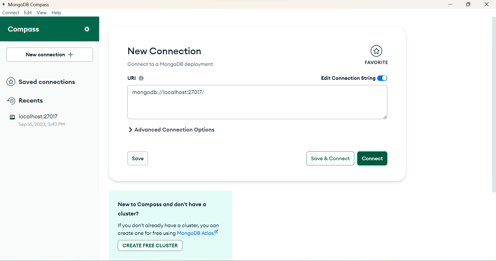  

### Langkah 2
> Download dan jalankan node setup. <br /><br />
>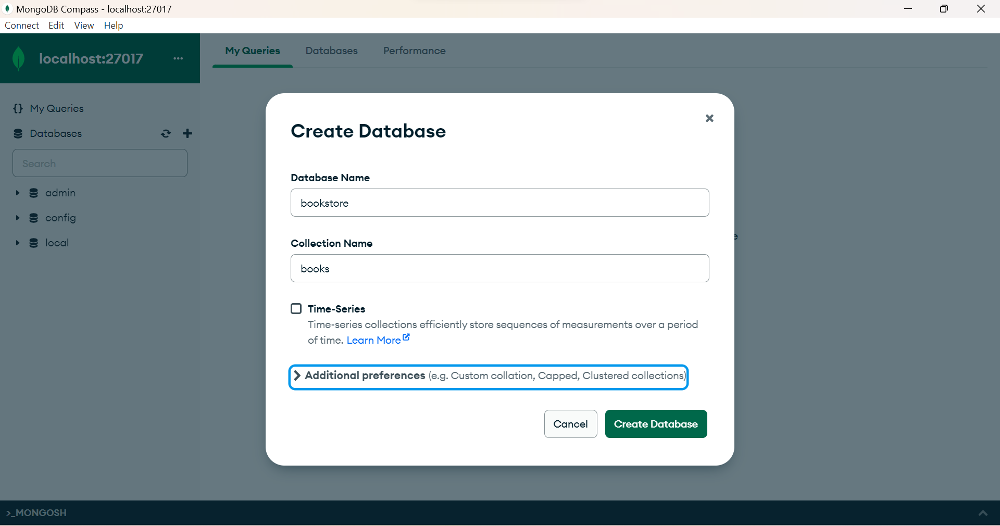  

### Langkah 3
> Setelah instalasi selesai jalankan command ```node -v``` untuk memeriksa apakah NodeJS sudah terinstall. <br /><br />
>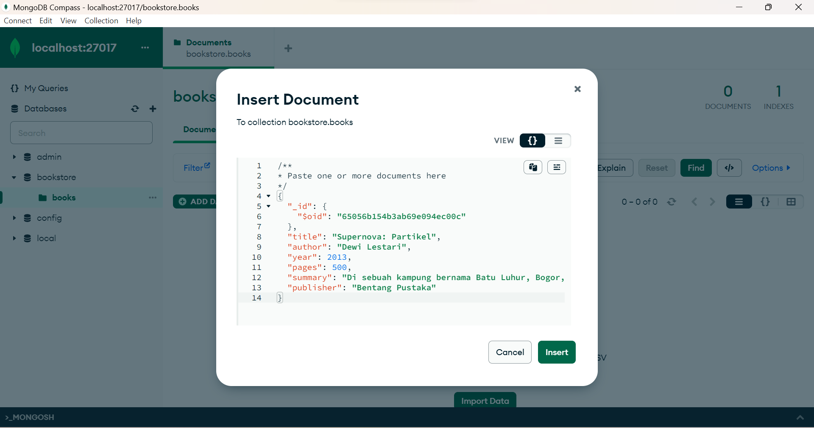  

## MongoDB Compass
### Langkah 1
> Lakukan koneksi ke MongoDB menggunakan connection string. <br /><br />
>  

### Langkah 2
> Buat database dengan melakukan klik "Create Database". <br /><br />
>  

### Langkah 3
> Lakukan insert buku pertama dengan melakukan klik "Add Data", pilih "Insert Document", isi dengan data yang diinginkan dan klik "Insert". <br /><br />
>  

### Langkah 4
> Lakukan insert buku kedua dengan cara yang sama. <br /><br />
>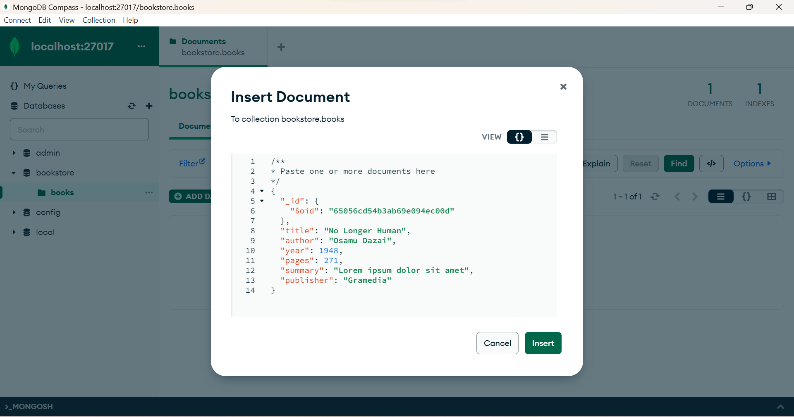  
>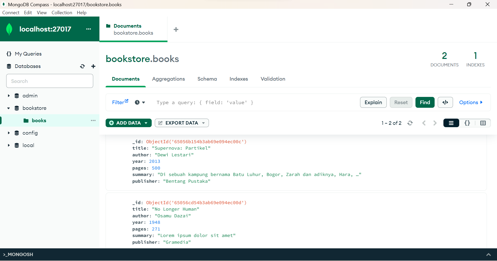  

### Langkah 5
> Lakukan pencarian buku dengan author "Osamu Dazai" dengan mengisi filter yang diinginkan dan klik "Find". <br /><br />
>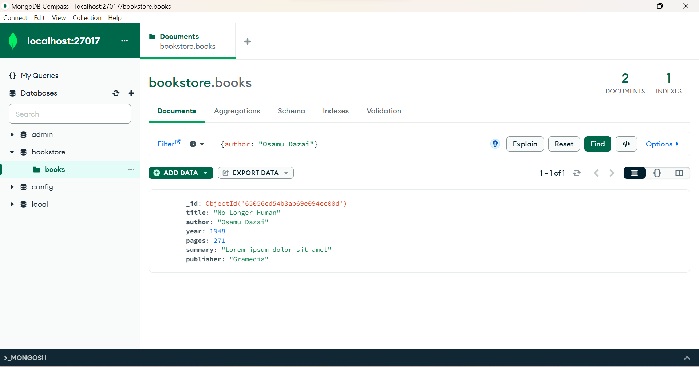  

### Langkah 6
> Lakukan perubahan summary pada buku "No Longer Human" menjadi "Buku yang bagus (<NAMA>,<NIM>)" dengan melakukan klik "Edit Document" (berlambang pensil), mengisi nilai summary yang baru, dan melakukan klik "Update". <br /><br />
>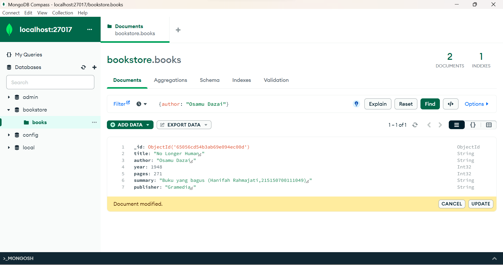  
>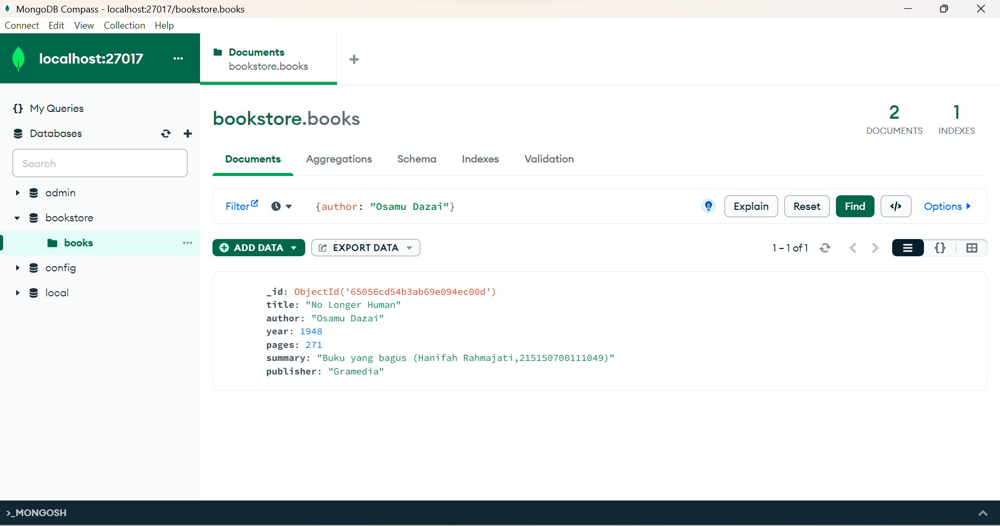  

### Langkah 7
> Lakukan penghapusan pada buku "Supernova: Partikel" dengan melakukan klik "Remove Document" (berlambang tong sampah) dan melakukan klik "Delete". <br /><br />
>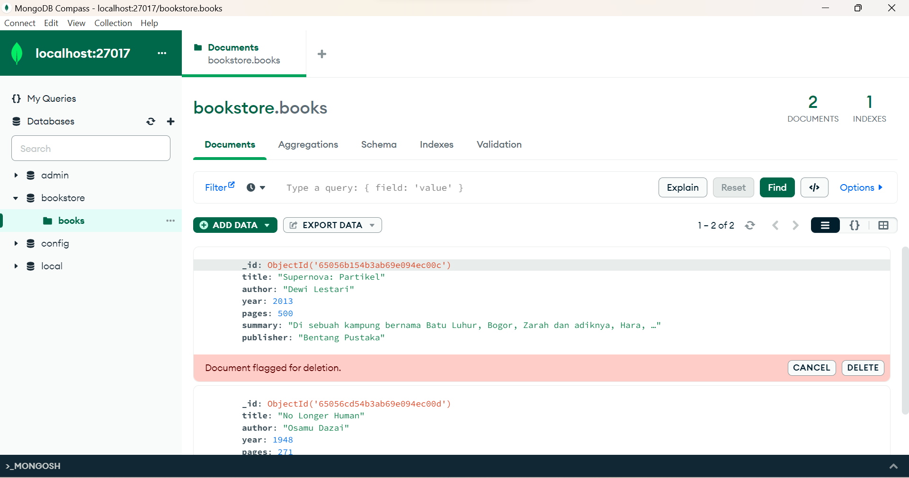  

## MongoDB Shell
### Langkah 1
> Lakukan koneksi ke MongoDB Server dengan menjalankan command ```mongosh``` bagi yang menggunakan terminal build in OS. Apabila menggunakan MongoDB atlas, copy connection string dari MongoDB atlas dan paste-kan di terminal. <br /><br />
>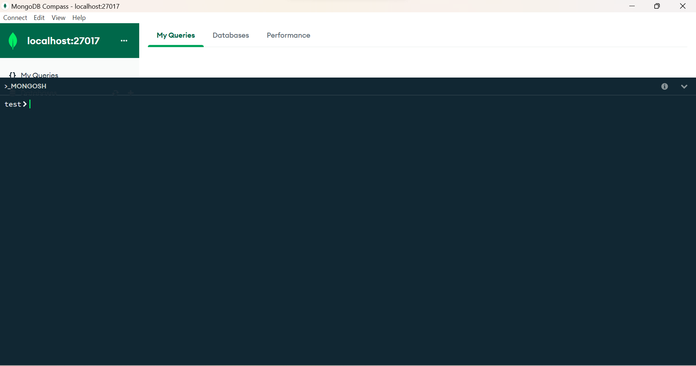  

### Langkah 2
> Mencoba melihat list database yang ada di server dengan menjalankan command ```show dbs```. <br /><br />
>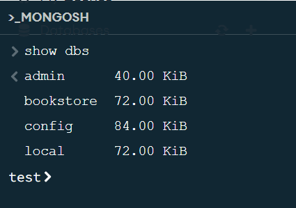  
> Untuk berpindah ke database "bookstore" gunakan command ```use bookstore```, kalian dapat memastikan telah berpindah ke database yang benar dengan melihat tulisan sebelum tanda ">". <br /><br />
>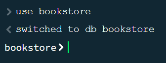  
> Cobalah untuk melihat collection yang ada pada database tersebut dengan menggunakan command ```show collections```. <br /><br />
>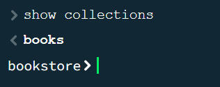  

### Langkah 3
> Lakukan insert buku "Overlord I" dengan menggunakan command ```db.books.insertOne(<data kalian>)```. <br /><br />
>  

### Langkah 4
> Lakukan insert buku "The Setting Sun" dan "Hujan" dengan insert many dengan menggunakan command ```db.books.insertMany(<data kalian>)```. <br /><br />
>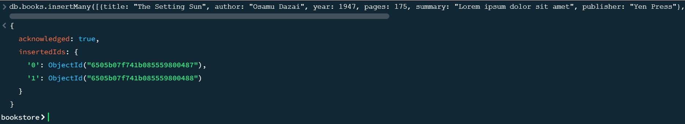  

### Langkah 5
> Lakukan pencarian buku dengan menggunakan command ```db.books.find()``` untuk melakukan pencarian semua buku. <br /><br />
>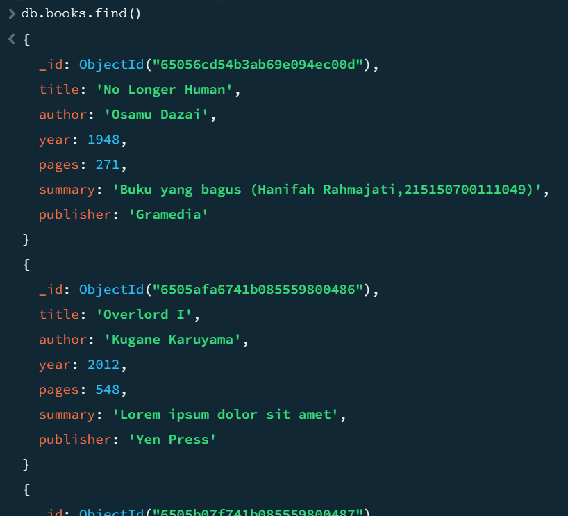  

### Langkah 6
> Tampilkan seluruh buku dengan author "Osamu Dazai" dengan mengisi argument pada find() dengan menggunakan command ```db.books.find({<filter yang ingin diisi>})```. <br /><br />
>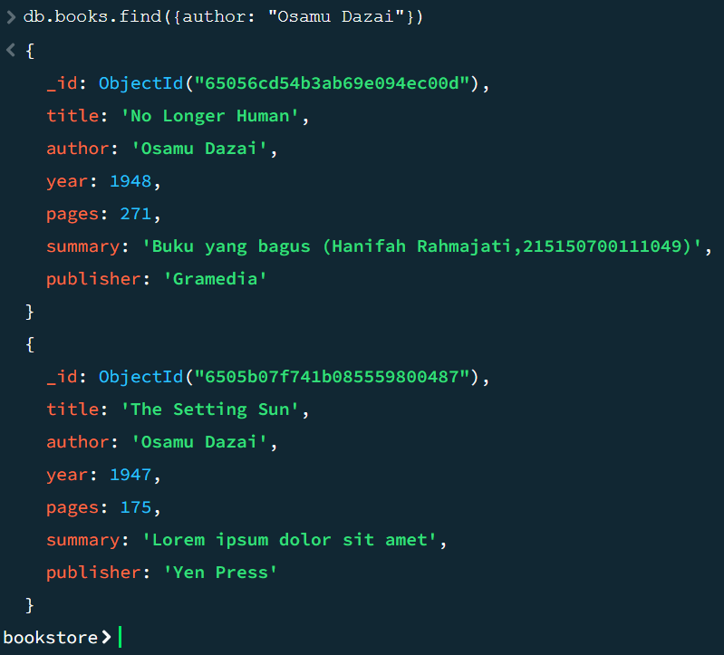  

### Langkah 7
> Lakukan perubahan summary pada buku "Hujan" menjadi "Buku yang bagus (<NAMA>,<NIM>)" dengan mengunakan command ```db.books.updateOne({<filter>}, {$set: {<data yang akan di update>}})```. <br /><br />
>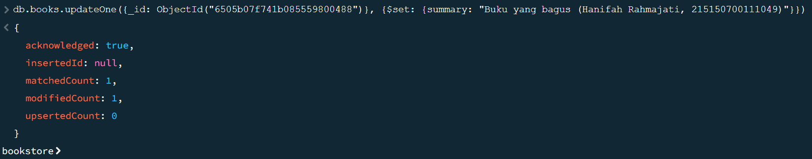  

### Langkah 8
> Lakukan perubahan publisher menjadi "Yen Press" pada semua buku "Osamu Dazai" dengan menggunakan command ```db.books.updateMany({<filter>}, {$set: {<data yang akan di update>}})```. <br /><br />
>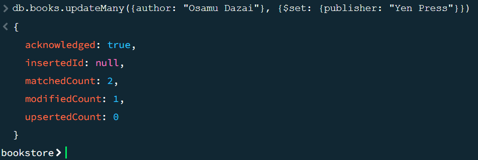  

### Langkah 9
> Lakukan penghapusan pada buku "Overlord I" dengan menggunakan command ```db.books.deleteOne({<argument>})```. <br /><br />
>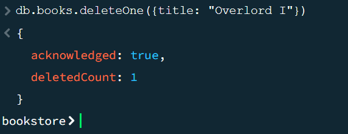  

### Langkah 10
> Lakukan penghapusan pada semua buku "Osamu Dazai" dengan menggunakan command ```db.books.deleteMany({<argument>})```. <br /><br />
>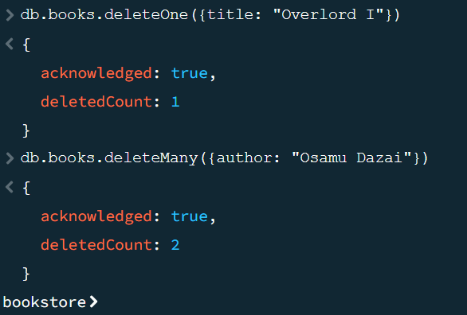  