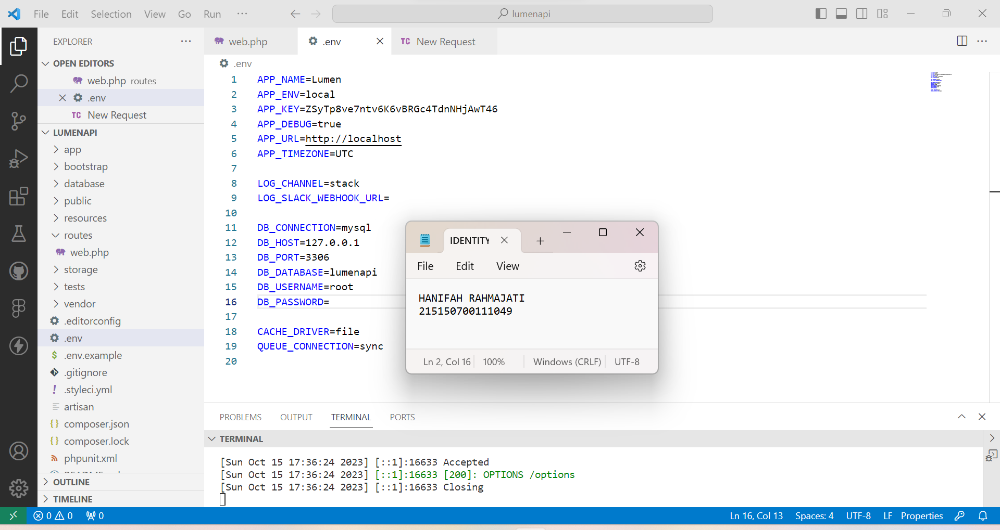

# Modul 4 Pemrograman Integratif TI-A

<div align="center">
<strong><p>Modul 4 Pemrograman Integratif TI-A - Basic Routing dan Migration</p></strong>
<strong><p>Hanifah Rahmajati - 215150700111049</p></strong>
</div>  
  
## GET
### Langkah 1
Membuka file "web.php" pada folder "routes" dan menambahkan kode berikut. Jalankan aplikasi menggunakan command ```php -S localhost:8000 -t public``` pada terminal VS CODE <br /><br />
 <br /><br />

### Langkah 2
Buka browser dan akses path ```http://localhost:8000/get``` <br /><br />
 <br /><br />

## POST, PUT, PATCH, DELETE, dan OPTIONS
### Langkah 1
Tambahkan method POST, PUT, PATCH, DELETE, dan OPTIONS pada file "web.php" di folder "routes" dengan code berikut <br /><br />
 <br /><br />

### Langkah 2
Install ekstensi Thunder Client di VS CODE <br /><br />
 <br /><br />

### Langkah 3
Klik icon petir pada sidebar kiri di VS CODE kemudian klik button "New Request" untuk membuat request baru. <br /><br />
 <br /><br />

### Langkah 4
Masukkan method dan URL yang sesuai. <br /><br />
GET <br /><br />
 <br /><br />
POST <br /><br />
 <br /><br />
PUT <br /><br />
 <br /><br />
DELETE <br /><br />
 <br /><br />
PATCH <br /><br />
 <br /><br />
OPTIONS <br /><br />
 <br /><br />

## Migrasi Database
### Langkah 1
Akses server database melalui ```localhost/phpmyadmin``` dan buat database baru bernama "lumenapi". <br /><br />
 <br /><br />

### Langkah 2
Ubah konfigurasi database pada file .env sesuai server yang digunakan. Pada percobaan ini, database menggunakan port 3306 dan tidak menggunakan password sehingga password di-set kosong. <br /><br />
 <br /><br />

### Langkah 3
Aktifkan library bawaan Lumen pada file "app.php" di folder "bootstrap" dengan menghapus tanda comment yang ada. <br /><br />
 <br /><br />

### Langkah 4
Jalankan command ```php artisan make:migration create_users_table``` untuk membuat migrasi tabel users serta command ```php artisan make:migration create_products_table``` untuk membuat migrasi tabel produts pada terminal. <br /><br />
 <br /><br />

### Langkah 5
Ubah fungsi up pada file migrasi create_users_table. <br /><br />
 <br /><br />

### Langkah 6
Ubah fungsi up pada file migrasi create_products_table. <br /><br />
 <br /><br />

### Langkah 7
Jalankan command ```php artisan migrate``` pada terminal untuk melakukan migrasi tabel yang sudah dibuat. <br /><br />
 <br /><br />