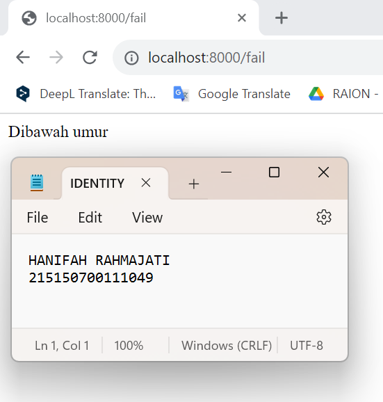

# Modul 5 Pemrograman Integratif TI-A

<div align="center">
<strong><p>Modul 5 Pemrograman Integratif TI-A - Dynamic Route dan Middleware</p></strong>
<strong><p>Hanifah Rahmajati - 215150700111049</p></strong>
</div>  
  
## Dynamic Route
### Langkah 1
Menambahkan baris kode untuk dynamic routes pada file "web.php" pada folder "routes" seperti berikut. <br /><br />
 <br /><br />

### Langkah 2
Buka browser dan akses path ```http://localhost:8000/user/1``` <br /><br />
 <br /><br />
Buka browser dan akses path ```http://localhost:8000/user/2``` <br /><br />
 <br /><br />

### Langkah 3
Tambahkan paramater pada file "web.php" pada folder "routes" dengan baris kode seperti berikut. <br /><br />
 <br /><br />

### Langkah 4
Buka browser dan akses path ```http://localhost:8000/post/2/comments/2``` <br /><br />
 <br /><br />

### Langkah 5
Tambahkan optional routes pada file "web.php" pada folder "routes" dengan baris kode seperti berikut. <br /><br />
 <br /><br />

### Langkah 6
Buka browser dan akses path ```http://localhost:8000/users``` <br /><br />
 <br /><br />
Buka browser dan akses path ```http://localhost:8000/users/id``` <br /><br />
 <br /><br />

## Aliases Route
### Langkah 1
Menambahkan baris kode untuk aliases routes pada file "web.php" pada folder "routes" seperti berikut. <br /><br />
 <br /><br />

### Langkah 2
Buka browser dan akses path ```http://localhost:8000/auth/login``` <br /><br />
 <br /><br />

### Langkah 3
Menambahkan baris kode untuk group routes pada file "web.php" pada folder "routes" seperti berikut. <br /><br />
 <br /><br />

### Langkah 4
Buka browser dan akses path ```http://localhost:8000/auth/users``` <br /><br />
 <br /><br />

## Middleware
### Langkah 1
Copy file "ExampleMiddleware" pada "app/Http/Middleware", ubah nama file menjadi "AgeMiddleware", kemudian memasukkan baris kode berikut. <br /><br />
 <br /><br />

### Langkah 2
Daftarkan "AgeMiddleware" pada aplikasi dengan menambahkan baris kode berikut di dalam file bootstrap/app.php <br /><br />
 <br /><br />

### Langkah 3
Tambahkan route middleware dengan memasukkan baris kode berikut pada file routes/web.php <br /><br />
 <br /><br />

### Langkah 4
Buka browser dan akses path ```http://localhost:8000/auth/home```. Halaman akan dialihkan ke ```/fail``` karena parameter umur tidak dimasukkan pada route. <br /><br />
 <br /><br />