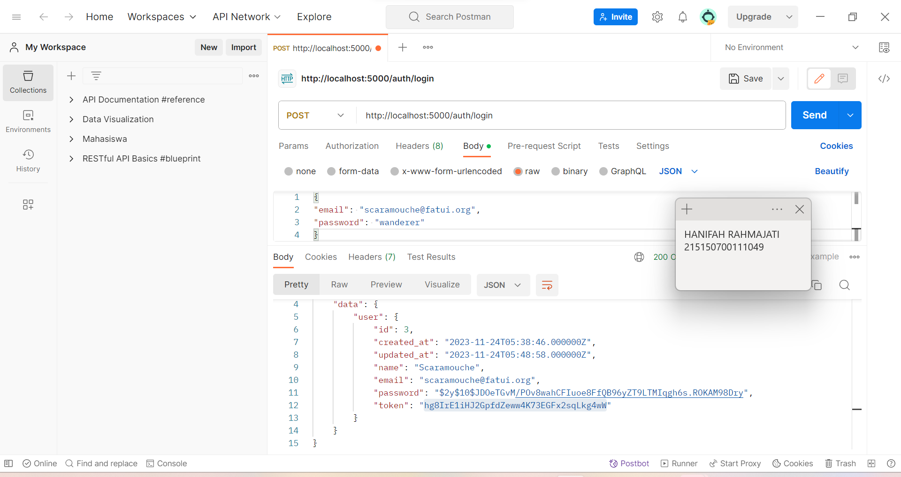

# Modul 8 Pemrograman Integratif TI-A

<strong>
Modul 8 Pemrograman Integratif TI-A - Register, Authentication dan Authorization
</strong>
<strong>
Hanifah Rahmajati - 215150700111049
</strong>

  
  
## Register
### Langkah 1
Memastikan terdapat tabel users yang dibuat menggunakan migration pada bab 3 Basic Routing dan Migration.   
   

### Langkah 2
Memastikan terdapat model User.php yang digunakan pada bab 5 Model, Controller dan Request-Response Handler.   
   

### Langkah 3
Membuat file AuthController.php.   
   

### Langkah 4
Menambahkan baris berikut pada routes/web.php.   
   

### Langkah 5
Jalankan aplikasi pada endpoint /auth/register.   
   

## Authentication
### Langkah 1
Membuat fungsi login(Request $request) pada file AuthController.php.   
   

### Langkah 2
Menambahkan baris berikut pada routes/web.php.   
   

### Langkah 3
Jalankan aplikasi pada endpoint /auth/login.   
a. Email dan password benar.   
   
b. Email benar, password salah.   
   

## Token
### Langkah 1
Membuat migrasi baru.   
   

### Langkah 2
Menambahkan kode pada migrasi yang sudah dibuat.   
   

### Langkah 3
Menambahkan atribut token di $fillable pada User.php.   
   

### Langkah 4
Menambahkan baris kode pada file AuthController.php.   
   

### Langkah 5
Menjalankan php artisan migrate untuk menjalankan migrasi terbaru.   
   

### Langkah 6
Menjalankan aplikasi pada endpoint /auth/login.   
   

## Authorization
### Langkah 1
Membuat file Authorization.php pada folder App/Http/Middleware.   
   

### Langkah 2
Menambahkan middleware yang baru dibuat pada bootstrap/app.php.   
   

### Langkah 3
Membuat fungsi home() pada HomeController.php.   
   

### Langkah 4
Menambahkan baris kode pada file routes/web.php.   
   

### Langkah 5
Menjalankan aplikasi pada endpoint /home dengan melampirkan nilai token yang didapat setelah login pada header.   
   
