# Modul 9 Pemrograman Integratif TI-A

<strong>
Modul 9 Pemrograman Integratif TI-A - JSON Web Token (JWT)
</strong>
<strong>
Hanifah Rahmajati - 215150700111049
</strong>

  
  
## Penyesuaian Database
### Langkah 1
Melakukan perubahan pada length kolom token dengan menghapus parameter 72 di belakangnya.   
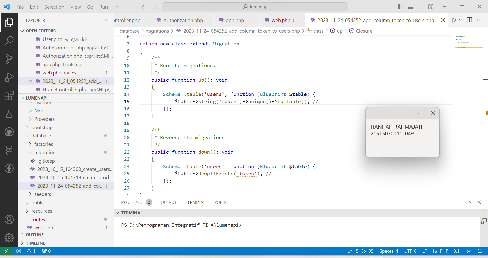   

### Langkah 2
Memperbaharui migrasi dan menghapus data yang lama.   
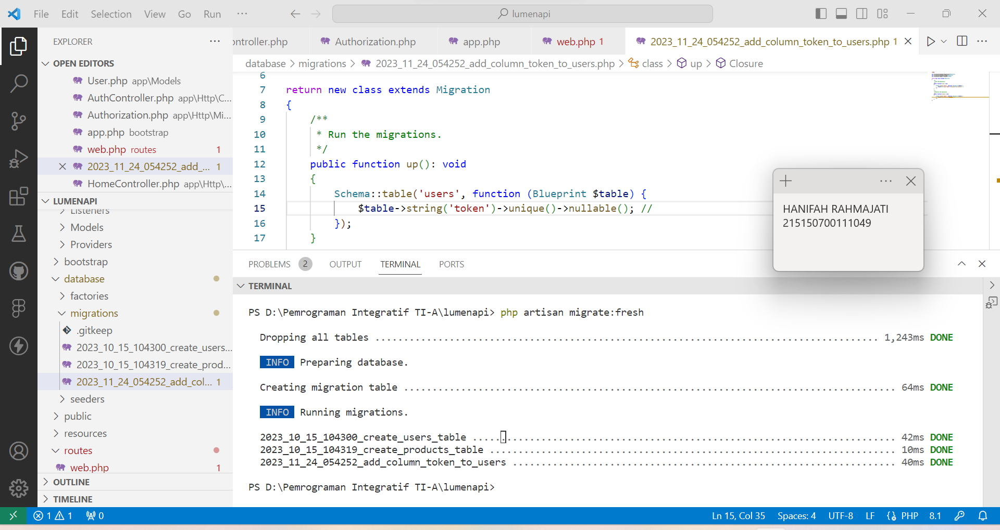   

### Langkah 3
Menjalankan aplikasi pada endpoint /auth/register.   
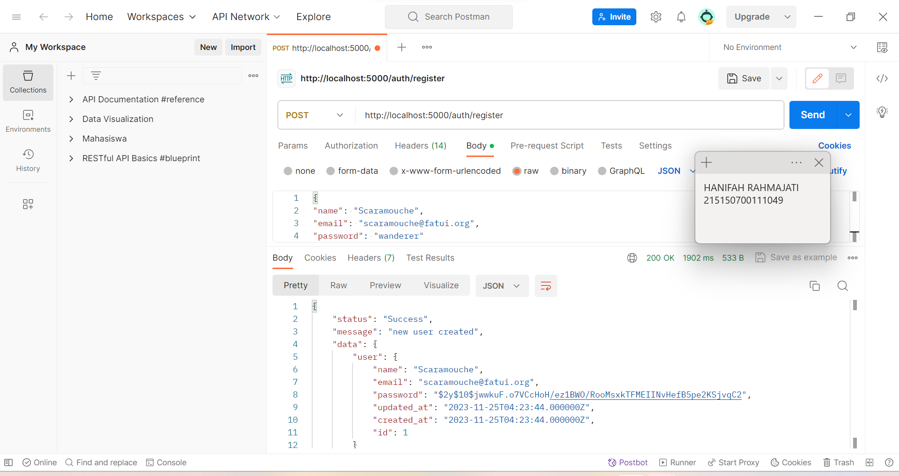   

## JWT Manual
### Langkah 1
Menambahkan ketiga fungsi berikut pada AuthController.php.   
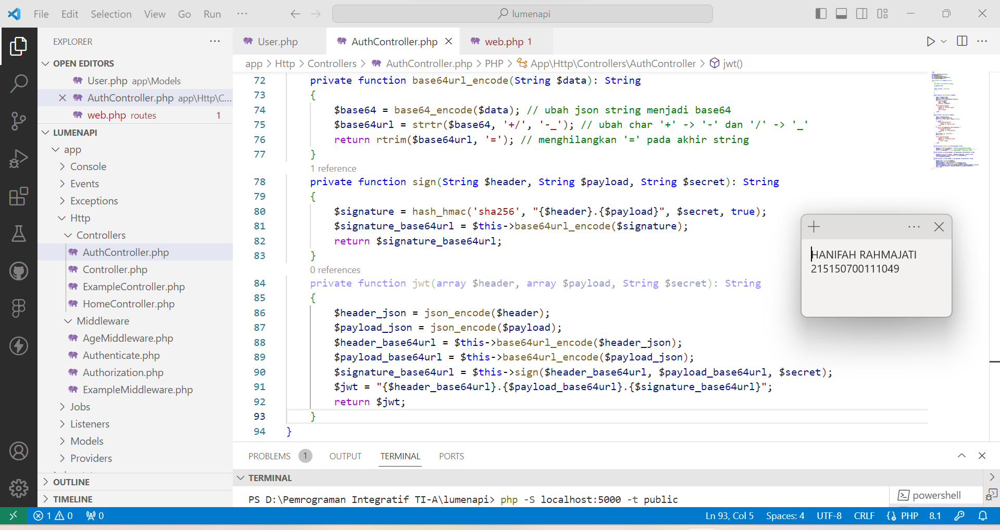   

### Langkah 2
Melakukan perubahan pada fungsi login.   
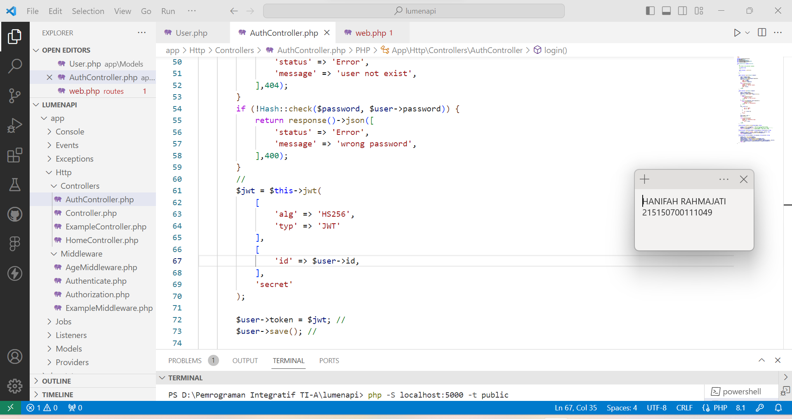   

### Langkah 3
Menambahkan keempat fungsi berikut pada Middleware/Authorization.php.   
   

### Langkah 4
Melakukan perubahan pada fungsi handle.   
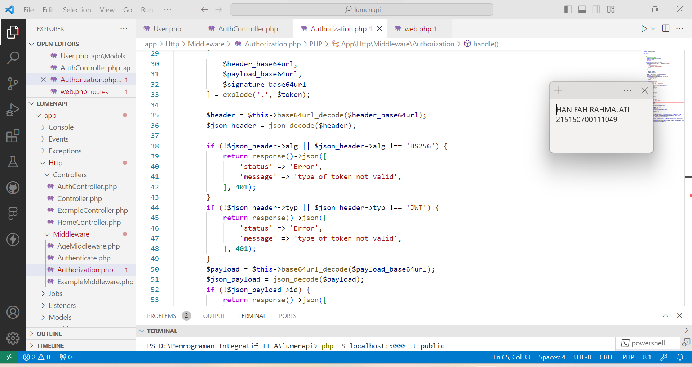   

### Langkah 5
Menjalankan aplikasi pada endpoint /auth/login.   
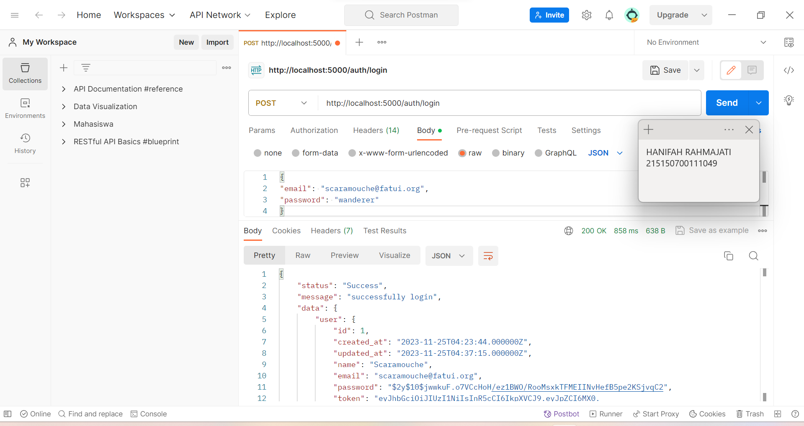   

### Langkah 6
Menjalankan aplikasi pada endpoint /home dengan melampirkan nilai token yang didapat setelah login pada header.   
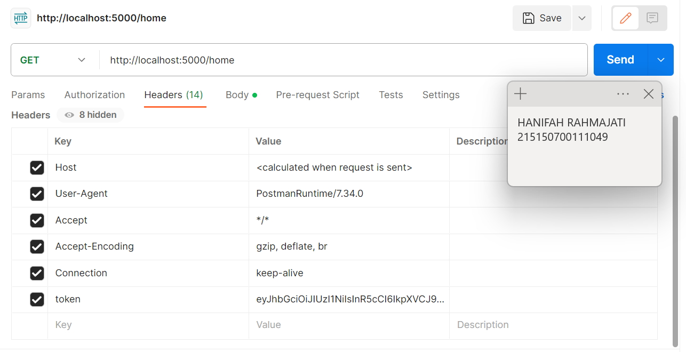   

## JWT Library
### Langkah 1
Generate jwt key secara online menggunakan website Djecrety ― Django Secret Key Generator. Setelah mendapatkan secret key kita akan memasukkan secret key tersebut pada file .env dengan membuat variable baru bernama JWT_SECRET.  
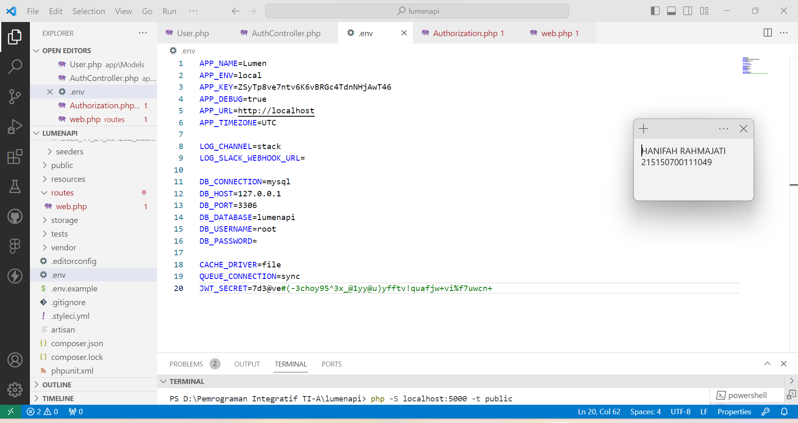   

### Langkah 2
Melakukan instalasi package jwt firebase.   
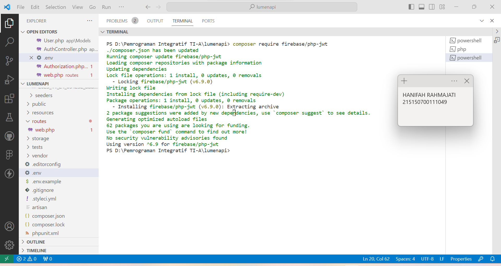   

### Langkah 3
Menambahkan fungsi berikut pada file AuthController.   
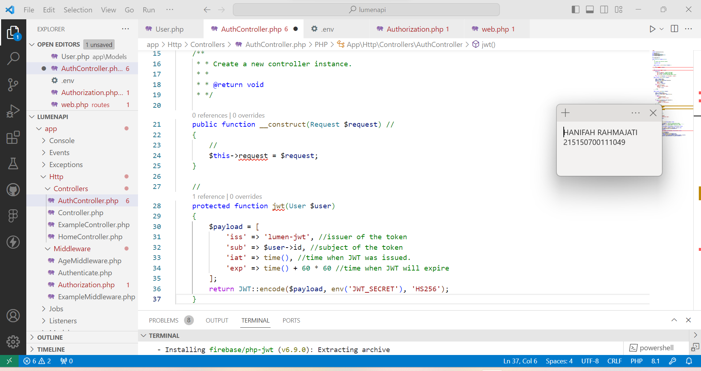   

### Langkah 4
Melakukan perubahan pada fungsi login.   
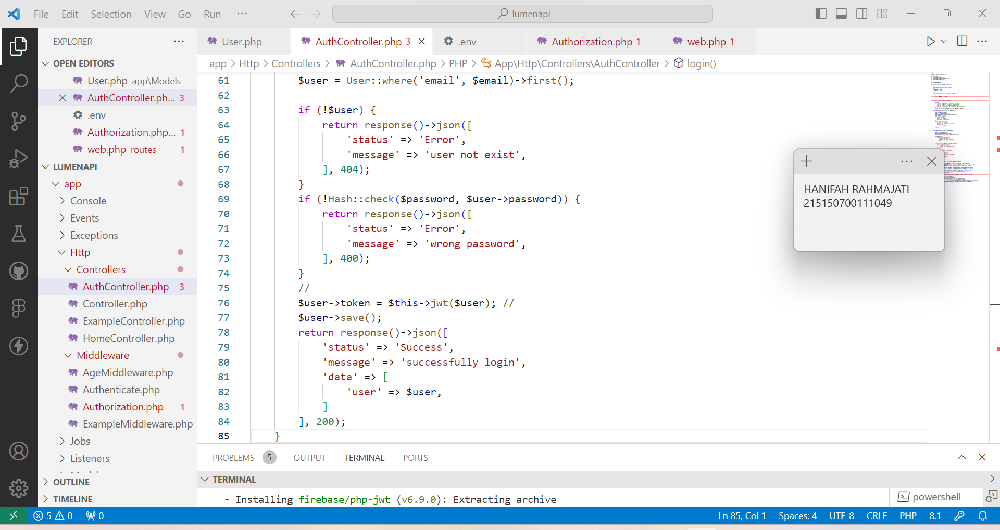   

### Langkah 5
Membuat file JwtMiddleware.php.   
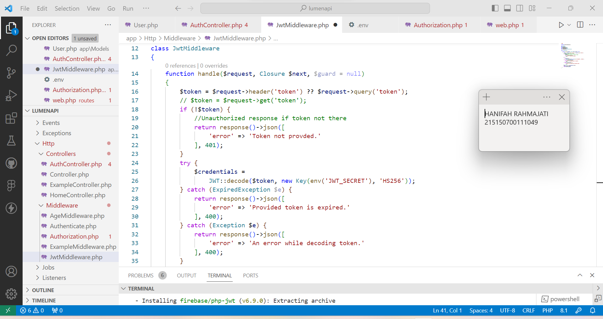   

### Langkah 6
Daftarkan middleware yang telah dibuat pada bootstrap/app.php.   
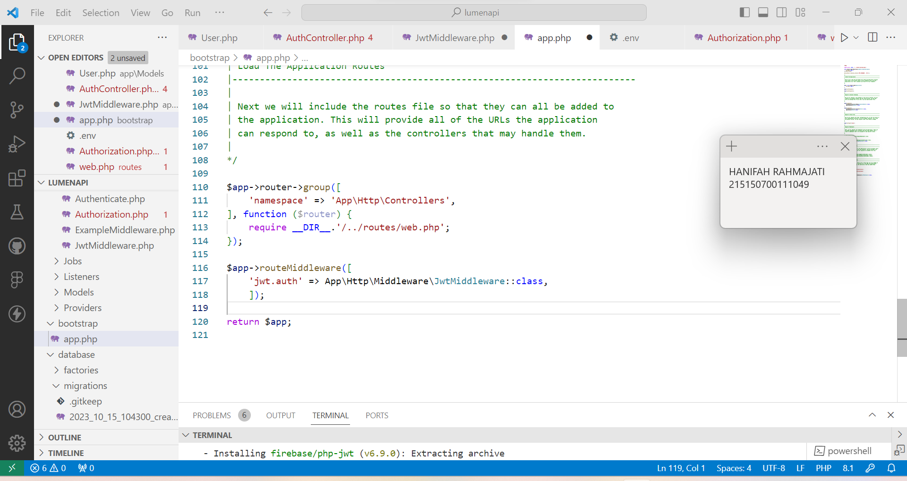   

### Langkah 7
Menambahkan baris pada file web.php.   
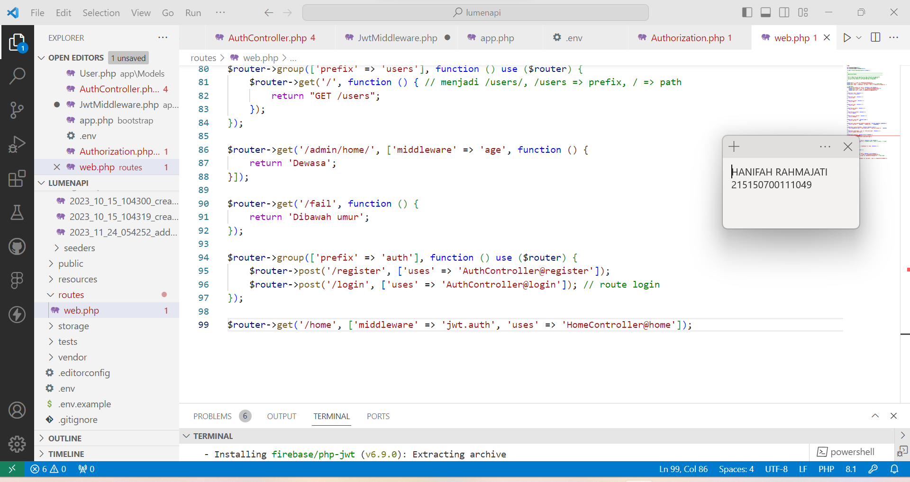   

### Langkah 8
Menjalankan aplikasi pada endpoint /auth/login.   
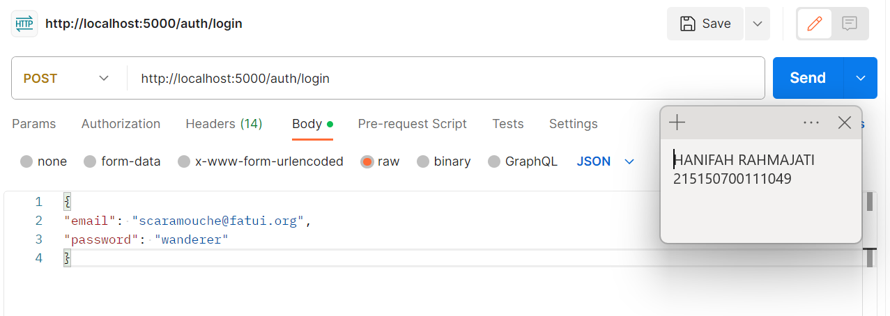   